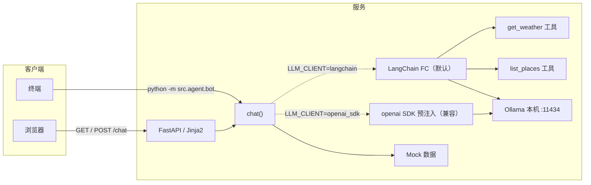

# 技术方案（Week 1-2）

## 目标

在**不接真实地图等外部业务 API** 的前提下，跑通「用户输入 → 可理解回复」的闭环；**天气**默认 **Mock**，可选接入 **和风 QWeather 实况**（见「和风天气」）。

**Week 2 补充**：在保留 Week 1 规则分支的同时，新增 **LangChain Function Calling** 路径（默认）；由模型决定是否调用天气 / 景点工具，见「大模型（可选 LLM）」。

## 架构概览

三层分工：

| 层级 | 职责 | 代码位置 |
|------|------|----------|
| **接入层** | HTTP、页面、表单参数（城市、消息） | `src/web/app.py`、`src/templates/index.html` |
| **Agent 层** | 可选 LLM；否则关键词与规则；组装回复 | `src/agent/bot.py` 的 `chat()`、`src/agent/llm.py` |
| **数据层** | 假地点列表；城市注册表（匹配名、和风 ID、Mock 天气回退）；天气为和风或 Mock | `config/cities.json`、`src/data/cities_config.py`、`src/data/mock.py`、`src/data/weather_source.py` |



说明：`LLM_MODE=off` 仅走规则；`LLM_MODE=ollama/openai` 时进入大模型路径。默认 `LLM_CLIENT=langchain` 走 FC；设为 `openai_sdk` 则回退 Week 1 的预注入模式。

## 和风天气 QWeather（可选）

- **触发条件**：同时配置环境变量 `QWEATHER_HOST`（控制台中的 API Host，可写 `https://xxx.re.qweatherapi.com` 或省略协议由代码补全）与 `QWEATHER_KEY`（控制台凭据里 **API KEY** 方式生成的 Key）。未配置或请求失败时 **`get_weather_for_city()` 回退 Mock**，行为与早期 Week 1 一致，便于单测与离线开发。
- **接口**：`GET {QWEATHER_HOST}/v7/weather/now?location={LocationID}`，请求头带 **`X-QW-Api-Key: {API_KEY}`**（控制台「API KEY」凭据，勿与 URL 参数 `key` 混用）。响应用 `now.text`、`now.temp` 映射为与 Mock 相同的 `weather` / `temp` 字段。响应为 Gzip，由 `httpx` 自动解压。
- **城市 → LocationID**：由 `config/cities.json` 加载为 `cities_config.CITY_TO_LOCATION_ID`（`weather_source` 使用）；不在表内则 **`GET .../geo/v2/city/lookup?location=城市名&number=1&range=cn`**，同样带 **`X-QW-Api-Key`**，取第一条结果的 `id` 并进程内缓存。
- **安全**：Key 与 Host **仅放 `.env`**，勿提交仓库。若控制台仅提供 **JWT** 凭据，需自行生成 `Authorization: Bearer` Token（见[和风身份认证](https://dev.qweather.com/docs/configuration/authentication/)），当前代码未实现 JWT 分支。

## 请求路径（Web）

1. `GET /` 返回静态模板页，前端用 `fetch` 以表单方式 `POST /chat`。
2. `POST /chat` 接收 `message`、`city`，在线程池中调用同步的 `chat(message, city)`（避免长时间阻塞事件循环），返回 JSON `{ "reply": "..." }`。
3. **无会话状态**：每次请求独立，不做服务端会话存储（Week 1 足够）。

## 大模型（可选 LLM）

### 协作须知（给伙伴）

- **默认行为**：不设或 `LLM_MODE=off` 时，**仅规则引擎 + Mock**，`pytest` 依赖此默认，**CI 务必保持 off**。
- **本地**：`LLM_MODE=ollama`，本机 [Ollama](https://ollama.com/) + `OLLAMA_MODEL` 等，见下表。
- **云端**：`LLM_MODE=openai`，配置 `OPENAI_API_KEY` 与 `OPENAI_BASE_URL`（OpenAI 官方或任意兼容 `/v1/chat/completions` 的服务，如 DeepSeek），**密钥仅环境变量 / `.env`，勿提交仓库**。
- **Railway**：容器内无 Ollama；若要对话走大模型，使用 **`LLM_MODE=openai`** 并在平台注入 `OPENAI_*`；否则 **`LLM_MODE=off`**。

### 环境变量一览

| 变量 | 说明 |
|------|------|
| `LLM_MODE` | `off`（默认）\|`ollama`\|`openai`。 |
| `LLM_CLIENT` | `langchain`（默认，Function Calling）\|`openai_sdk`（Week 1 兼容路径）。 |
| `OLLAMA_*` | 仅 `ollama` 时必填 `OLLAMA_MODEL`；`OLLAMA_BASE_URL` 默认 `http://127.0.0.1:11434`；`OLLAMA_HTTP_TIMEOUT` 默认 `600`。 |
| `OPENAI_API_KEY` | **openai** 时必填。 |
| `OPENAI_BASE_URL` | 可选，默认 `https://api.openai.com`（代码会自动补 `/v1`）。 |
| `OPENAI_MODEL` | 可选，默认 `gpt-4o-mini`；换厂商时按对方文档填写模型名。 |
| `OPENAI_HTTP_TIMEOUT` | 可选，秒，默认 `120`。 |

配置在 `src/agent/bot.py` 通过 `load_dotenv()` 加载；启动 Web 或终端 bot 前确保工作目录为项目根或 `.env` 可被找到。

### 调用链路与协议（Week 2）

1. `chat()` 在 `LLM_MODE=ollama/openai` 时读取 `LLM_CLIENT`：
   - 默认 `langchain`：走 `src/agent/langchain_fc.py::chat_with_tools`
   - `openai_sdk`：走 Week 1 兼容路径（`build_system_prompt` + `llm.complete`）
2. `chat_with_tools` 内使用 `ChatOpenAI(...).bind_tools([...])` 绑定工具：
   - `get_weather(city)`：调用 `agent_tools.get_weather_json`（和风失败回 Mock）
   - `list_places(city, query="")`：调用 `agent_tools.list_places_json`（`query` 为后续 RAG 预留）
3. FC 循环：模型返回 `tool_calls` -> 代码执行工具 -> 以 `ToolMessage` 回灌 -> 再次 `invoke`，直到模型返回最终自然语言或达到轮数上限（默认 8）。
4. `src/agent/llm.py` 仍保留 `openai` SDK 能力，并提供统一配置提取给 LangChain 使用；`ollama/openai` 均走 OpenAI 兼容 `/v1` 协议。

### 工具与数据边界

- `weather`：来源 `get_weather_for_city()`（和风实况优先，失败回退 `config/cities.json` 的 Mock）。
- `places`：来源 `src/data/mock.py`；`list_places` 返回 JSON 列表，名称与字段不应被模型改写。
- `list_places(query)`：当前忽略 `query`，但接口已保留，后续可在不改 tool 名的前提下切换到向量检索（RAG）。

### 与 Week 1 的兼容关系

- 规则分支（`LLM_MODE=off`）不变，单测/CI 仍建议保持该模式。
- `LLM_CLIENT=openai_sdk` 可回退到 Week 1 预注入逻辑，便于排障或对比。
- 默认 `LLM_CLIENT=langchain` 体现 Week 2 目标：由模型决定是否调用工具，而非业务层预取所有数据。

### 自检命令（本机）

```bash
ollama list
curl -s http://127.0.0.1:11434/api/tags
```

## 运行与部署

- **本地 / 线上进程**：`uvicorn` 加载 ASGI 应用 `src.web.app:app`。
- **Railway**：监听 `0.0.0.0` 与环境变量 `PORT`；依赖由 `requirements.txt` 安装；大模型可选 **`LLM_MODE=openai`** + 平台环境变量注入 `OPENAI_API_KEY` 等，或 **`LLM_MODE=off`**。

## 刻意未做（后续迭代）

- 地图 / POI 等内容源 API（地点仍为 Mock）  
- 和风 Geo 重名细化（`adm` 参数、用户选具体行政区）  
- 用户画像、数据库与登录  

以上在架构上可替换为：**数据层**换真实数据源，**Agent 层**从 `list_places(query)` 内部切到 RAG 检索并叠加 Memory / ReAct，**接入层**基本可保持不变。
