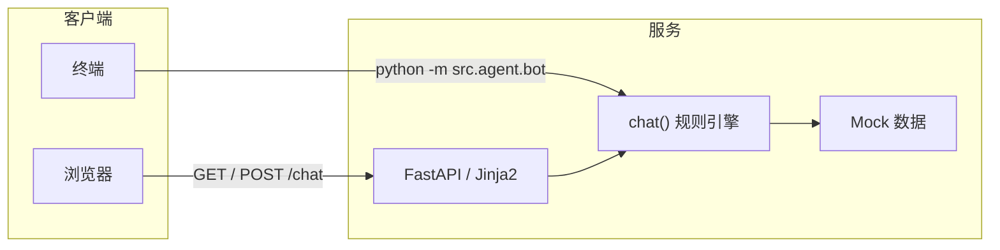

# 技术方案（Week 1）

## 目标

在**不接真实外部 API** 的前提下，跑通「用户输入 → 可理解回复」的闭环：浏览器或终端对话，数据全部来自 **Mock**。

## 架构概览

三层分工：

| 层级 | 职责 | 代码位置 |
|------|------|----------|
| **接入层** | HTTP、页面、表单参数（城市、消息） | `src/web/app.py`、`src/templates/index.html` |
| **Agent 层** | 关键词与规则判断，组装自然语言回复 | `src/agent/bot.py` 的 `chat()` |
| **数据层** | 假天气、假地点列表 | `src/data/mock.py` |

## 请求路径（Web）

1. `GET /` 返回静态模板页，前端用 `fetch` 以表单方式 `POST /chat`。
2. `POST /chat` 接收 `message`、`city`，调用 `chat(message, city)`，返回 JSON `{ "reply": "..." }`。
3. **无会话状态**：每次请求独立，不做服务端会话存储（Week 1 足够）。

## 运行与部署

- **本地 / 线上进程**：`uvicorn` 加载 ASGI 应用 `src.web.app:app`。
- **Railway**：监听 `0.0.0.0` 与环境变量 `PORT`；依赖由 `requirements.txt` 安装。

## 刻意未做（后续迭代）

- 真实天气 / 地图 / 内容源 API  
- LLM 调用与用户画像  
- 数据库与登录  

以上在架构上可替换为：**数据层**换真实数据源，**Agent 层**在规则外加模型或检索，**接入层**基本可保持不变。
