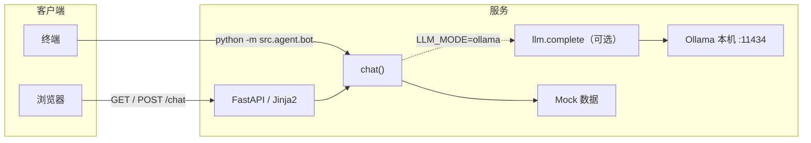

# 技术方案（Week 1）

## 目标

在**不接真实地图等外部业务 API** 的前提下，跑通「用户输入 → 可理解回复」的闭环；**天气**默认 **Mock**，可选接入 **和风 QWeather 实况**（见「和风天气」）。

**补充（可选）**：本机 **Ollama** 启用后，由模型组织自然语言回复，天气字段仍来自 `get_weather_for_city()`（和风或 Mock），见「本地 Ollama」。

## 架构概览

三层分工：

| 层级 | 职责 | 代码位置 |
|------|------|----------|
| **接入层** | HTTP、页面、表单参数（城市、消息） | `src/web/app.py`、`src/templates/index.html` |
| **Agent 层** | 可选 LLM；否则关键词与规则；组装回复 | `src/agent/bot.py` 的 `chat()`、`src/agent/llm.py` |
| **数据层** | 假地点列表；天气为 Mock 或和风实况 | `src/data/mock.py`、`src/data/weather_source.py` |



说明：虚线表示仅当 `LLM_MODE=ollama` 时，`chat()` 会调用 `llm` 模块请求本机 Ollama；默认 `off` 时不经过 `L` 与 `O`。

## 和风天气 QWeather（可选）

- **触发条件**：同时配置环境变量 `QWEATHER_HOST`（控制台中的 API Host，可写 `https://xxx.re.qweatherapi.com` 或省略协议由代码补全）与 `QWEATHER_KEY`（控制台凭据里 **API KEY** 方式生成的 Key）。未配置或请求失败时 **`get_weather_for_city()` 回退 Mock**，行为与早期 Week 1 一致，便于单测与离线开发。
- **接口**：`GET {QWEATHER_HOST}/v7/weather/now?location={LocationID}`，请求头带 **`X-QW-Api-Key: {API_KEY}`**（控制台「API KEY」凭据，勿与 URL 参数 `key` 混用）。响应用 `now.text`、`now.temp` 映射为与 Mock 相同的 `weather` / `temp` 字段。响应为 Gzip，由 `httpx` 自动解压。
- **城市 → LocationID**：先查 `weather_source.CITY_TO_LOCATION_ID`；不在表内则 **`GET .../geo/v2/city/lookup?location=城市名&number=1&range=cn`**，同样带 **`X-QW-Api-Key`**，取第一条结果的 `id` 并进程内缓存。
- **安全**：Key 与 Host **仅放 `.env`**，勿提交仓库。若控制台仅提供 **JWT** 凭据，需自行生成 `Authorization: Bearer` Token（见[和风身份认证](https://dev.qweather.com/docs/configuration/authentication/)），当前代码未实现 JWT 分支。

## 请求路径（Web）

1. `GET /` 返回静态模板页，前端用 `fetch` 以表单方式 `POST /chat`。
2. `POST /chat` 接收 `message`、`city`，在线程池中调用同步的 `chat(message, city)`（避免长时间阻塞事件循环），返回 JSON `{ "reply": "..." }`。
3. **无会话状态**：每次请求独立，不做服务端会话存储（Week 1 足够）。

## 本地 Ollama（可选 LLM）

### 协作须知（给伙伴）

- **默认行为**：不设或 `LLM_MODE=off` 时，与早期 Week 1 一致，**仅规则引擎 + Mock**，`pytest` 依赖此默认，**CI / 无 Ollama 环境务必保持 off**。
- **启用本地模型**：本机安装并运行 [Ollama](https://ollama.com/)，拉取模型后，在项目根配置 `.env`（勿提交仓库，见根目录 `.gitignore`）。可复制 `.env.example` 再改。
- **线上 Railway**：容器内**不会**自带 Ollama；部署时应使用 `LLM_MODE=off`，或后续接云端 API（当前 `LLM_MODE=openai` 为占位，见 `src/agent/llm.py` 注释）。

### 环境变量一览

| 变量 | 说明 |
|------|------|
| `LLM_MODE` | `off`：仅规则（默认）。`ollama`：走本机 Ollama。`openai`：云端预留，当前会提示未接入。 |
| `OLLAMA_BASE_URL` | 可选，默认 `http://127.0.0.1:11434`。 |
| `OLLAMA_MODEL` | **必填**（当 `ollama` 时），与 `ollama list` 中名称一致，如 `qwen3:4b`。 |
| `OLLAMA_API_KEY` | 可选，占位字符串即可（Ollama 兼容 OpenAI 客户端时不校验）。 |
| `OLLAMA_HTTP_TIMEOUT` | 可选，秒，默认 `600`；本地首次加载 / CPU 推理较慢时可避免过早超时。 |

配置在 `src/agent/bot.py` 通过 `load_dotenv()` 加载；启动 Web 或终端 bot 前确保工作目录为项目根或 `.env` 可被找到。

### 调用链路与协议

1. `chat()` 若判定 `LLM_MODE=ollama`，则根据当前 `city` 从 `MOCK_WEATHER` 取一条天气，并携带完整 `MOCK_PLACES` 列表。
2. `src/agent/llm.py` 中 `build_system_prompt(city, weather, places)` 将**人设、城市、两段 JSON 说明**拼成 **system** 消息；用户原话作为 **user** 消息。
3. 使用官方 Python 包 `openai` 的 `OpenAI` 客户端，`base_url` 指向 **`{OLLAMA_BASE_URL}/v1`**，即 Ollama 提供的 **OpenAI 兼容** `chat/completions` 接口（非 Ollama 原生 `/api/chat`）。
4. 模型返回的正文经 `chat()` 回到 Web 或终端。前端在等待期间会显示「思考中…」，以应对本地推理延迟。

**数据边界**：`weather` 与 `places` **仍为 Mock**（`src/data/mock.py`），仅作为 system 提示中的参考 JSON；接真实天气 / POI 时，替换传入 `build_system_prompt` 的数据来源即可，接入层 URL 可保持不变。

### 自检命令（本机）

```bash
ollama list
curl -s http://127.0.0.1:11434/api/tags
```

## 运行与部署

- **本地 / 线上进程**：`uvicorn` 加载 ASGI 应用 `src.web.app:app`。
- **Railway**：监听 `0.0.0.0` 与环境变量 `PORT`；依赖由 `requirements.txt` 安装；**建议 `LLM_MODE=off`**，除非另行提供可访问的推理端点。

## 刻意未做（后续迭代）

- 地图 / POI 等内容源 API（地点仍为 Mock）  
- 和风 JWT 认证；Geo 重名细化（`adm` 参数、用户选具体行政区）  
- 云端 OpenAI 兼容 API 的完整接入（环境变量位已预留）  
- 用户画像、数据库与登录  

以上在架构上可替换为：**数据层**换真实数据源，**Agent 层**在规则与 `build_system_prompt` 中换真实字段，**接入层**基本可保持不变。
